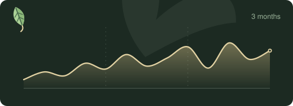
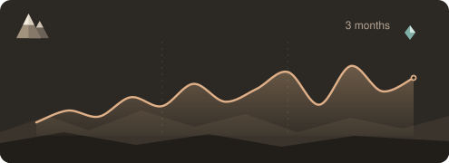
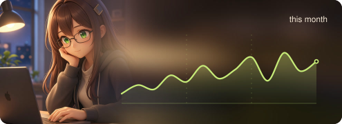
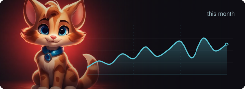
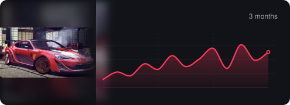
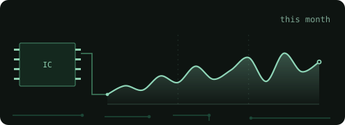
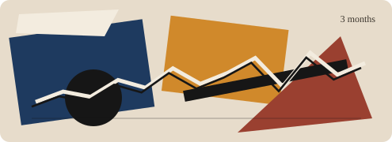
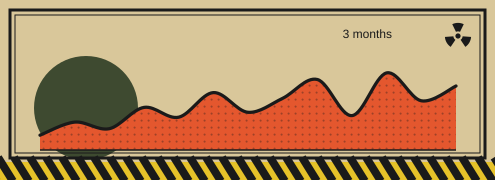
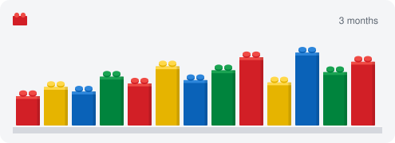
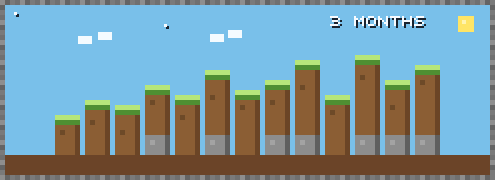

# Themed activity badges

Ten cards for a GitHub profile README. Each one shows 3 months of activity (13 weeks).

Live numbers come from a Node server (`server.js`). It fetches the contribution calendar from GitHub and draws an SVG. Files in `badges/` are visual templates; they do not know which account they belong to. On LEGO and Minecraft the same weeks are shown as bars. Height is scaled to the busiest week in that window.

```bash
node server.js
```

Public URL: `https://gh-badges-nine.vercel.app`. In the examples below the login is `ukarpenkov` — replace it with yours. Locally the same path is `http://127.0.0.1:8787/fallout?user=ukarpenkov`. An optional `GITHUB_TOKEN` switches the request to the official GraphQL API.

## How to embed

Paste one of the lines below into your profile `README.md`. Each card has its own background, so it looks fine on both light and dark themes.

## Themes

### Elvish



```html

```

### Mountain



```html

```

### Anime



```html

```

### Cats



```html

```

### Automotive



```html

```

### Circuits



```html

```

### Cubism



```html

```

### Fallout



```html

```

### LEGO



```html

```

### Minecraft



```html

```
